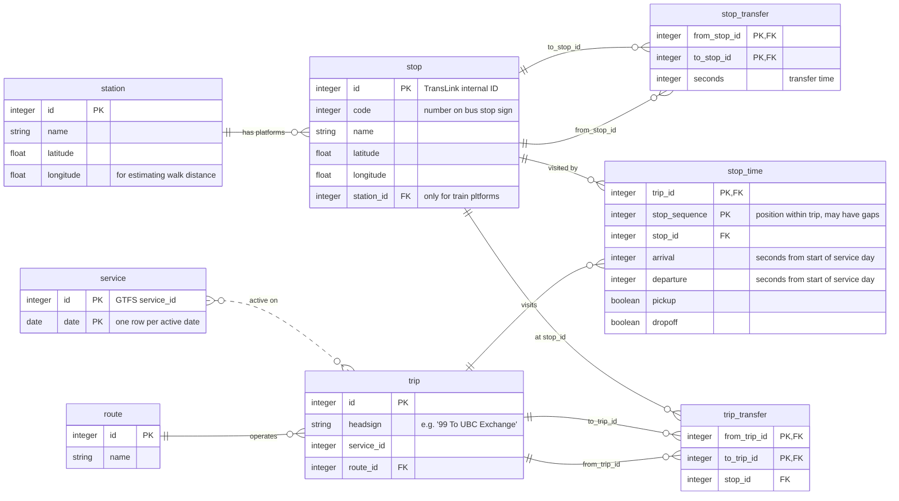

# Translink DB — ERD

```mermaid
erDiagram
	direction LR
	station {
		integer id PK ""
		string name  ""
		float latitude
		float longitude  "for estimating walk distance"
	}

	stop {
		integer id PK "TransLink internal ID"
		integer code  "number on bus stop sign"
		string name  ""
		float latitude
		float longitude
		integer station_id FK "only for train pltforms"
	}

	route {
		integer id PK ""
		string name  ""
	}

	service {
		integer id PK "GTFS service_id"
		date date PK "one row per active date"
	}

	trip {
		integer id PK ""
		string headsign  "e.g. '99 To UBC Exchange'"
		integer service_id  ""
		integer route_id FK ""
	}

	stop_time {
		integer trip_id PK,FK ""
		integer stop_sequence PK "position within trip, may have gaps"
		integer stop_id FK ""
		integer arrival  "seconds from start of service day"
		integer departure  "seconds from start of service day"
		boolean pickup  ""
		boolean dropoff  ""
	}

	stop_transfer {
		integer from_stop_id PK,FK ""
		integer to_stop_id PK,FK ""
		integer seconds  "transfer time"
	}

	trip_transfer {
		integer from_trip_id PK,FK ""
		integer to_trip_id PK,FK ""
		integer stop_id FK
	}

	station||--o{stop:"has platforms"
	route||--o{trip:"operates"
	service}o..o{trip:"active on"
	trip||--o{stop_time:"visits"
	stop||--o{stop_time:"visited by"
	stop||--o{stop_transfer:"from_stop_id"
	stop||--o{stop_transfer:"to_stop_id"
	trip||--o{trip_transfer:"from_trip_id"
	trip||--o{trip_transfer:"to_trip_id"
	stop||--o{trip_transfer:"at stop_id"
```
